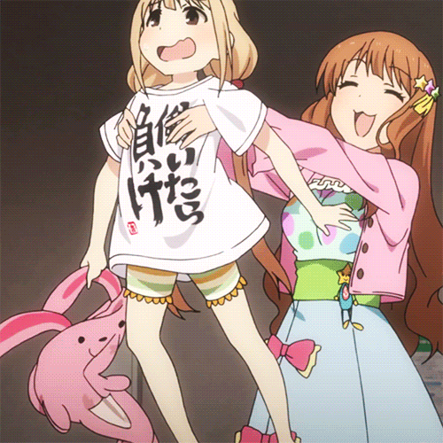

# THE D@TEMASTER
Go on a date with your favorite idol! This is a sample project intended to demonstrate the use of animation and transitions in a React web app.

## Stack
THE D@TEMASTER mainly uses the following libraries for presenting its content:
- animejs
- React Transition Group
- Semantic UI React

## Thanks
All graphics and resources retrieved from [usamin.info](https://usamin.info/i) and the [Project iM@S wiki](https://www.project-imas.com/wiki/).  Thanks for being guinea pigs for my nefarious endeavors.